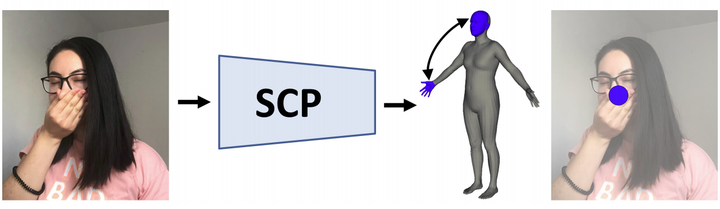
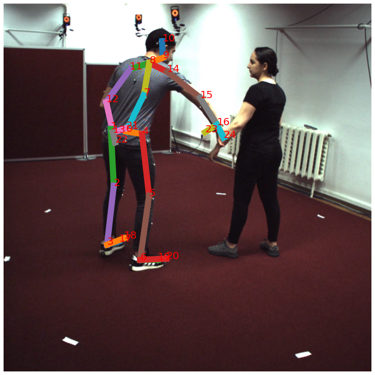
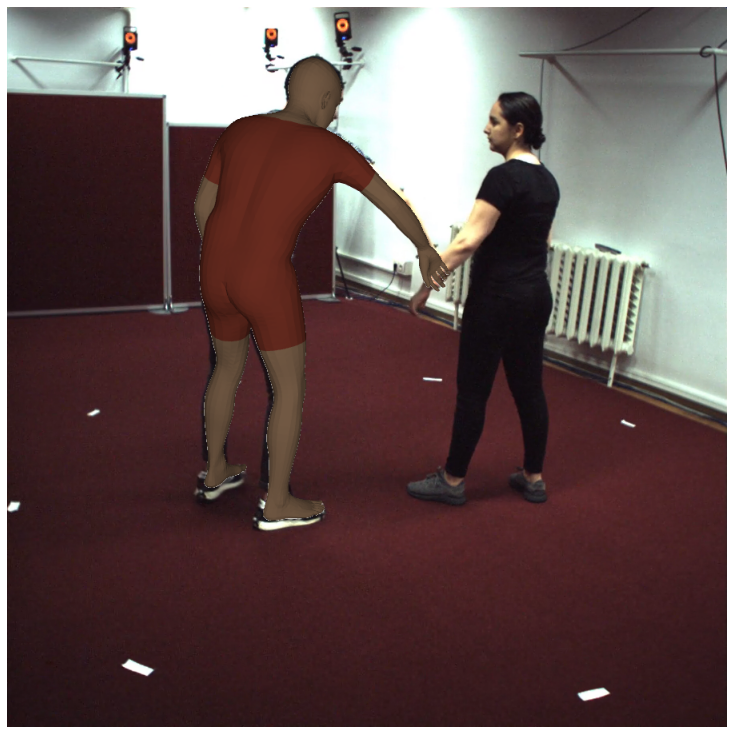
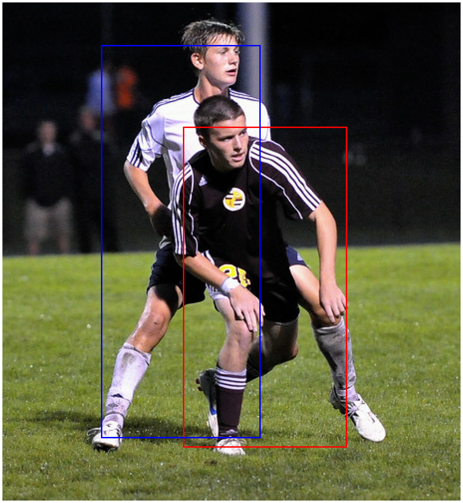
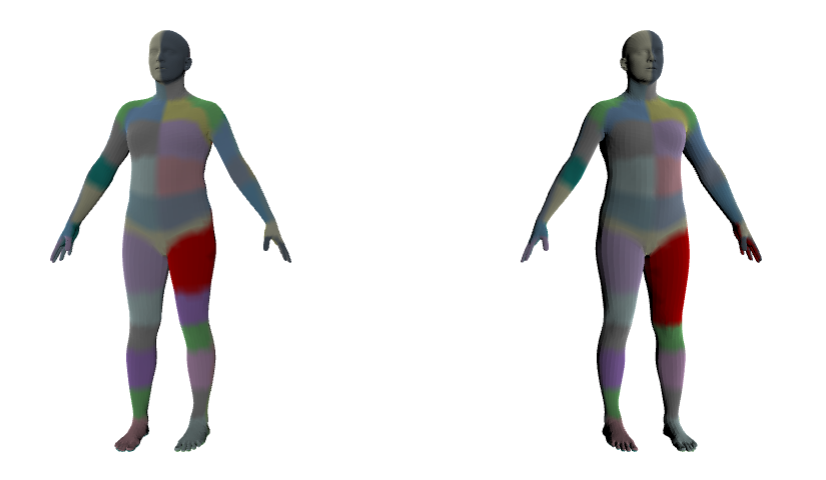

## IMAR Vision Datasets Tools

## Description
This repository contains tools to process and visualize the IMAR Vision Datasets. In addition, we make available the code for the evaluation server for the 3 reconstruction challenges that we introduce.
### Three-Dimensional Reconstruction of Human Interactions [[Paper](https://mihaifieraru.github.io/publication/fieraru_2020_cvpr/Fieraru_2020_CVPR.pdf)] [[Project / Data](http://vision.imar.ro/ci3d/)]


### Learning Complex 3D Human Self-Contact [[Paper](https://mihaifieraru.github.io/publication/fieraru_2021_aaai/Fieraru_2021_AAAI.pdf)] [[Project / Data](http://vision.imar.ro/sc3d)]


### AIFit: Automatic 3D Human-Interpretable Feedback Models for Fitness Training [[Paper](https://mihaifieraru.github.io/publication/fieraru_2021_cvpr/Fieraru_2021_CVPR.pdf)] [[Project / Data](http://vision.imar.ro/fit3d)]


## License
The terms of this software are available in [LICENSE](https://github.com/sminchisescu-research/imar_vision_datasets_tools/blob/master/LICENSE).
Note that the license of this software shall not be confused with the licenses of the datasets it supports.


## Instructions 
### Project Structure
Please organize your project in the following structure:
```bash
project
├── imar_vision_datasets_tools
├── venv
├── ghumrepo
|   ├── requirements.txt 
|   ├── ...
├── smplx_body_models
|   ├── smplx
|   |   ├── SMPLX_NEUTRAL.npz
|   |   ├── SMPLX_NEUTRAL.pkl
├── datasets
|   ├── chi3d
|   |   ├── train
|   |   ├── test
|   |   ├── info.json
|   |   ├── template.json
|   ├── FlickrCI3D_classification
|   |   ├── train
|   |   ├── test
|   ├── FlickrCI3D_signature
|   |   ├── train
|   |   ├── test
|   ├── humansc3d
|   |   ├── train
|   |   ├── test
|   |   ├── info.json
|   |   ├── template.json
|   ├── FlickrSC3D_classification
|   |   ├── train
|   |   ├── test
|   ├── FlickrSC3D_signature
|   |   ├── train
|   |   ├── test
|   ├── fit3d
|   |   ├── train
|   |   ├── test
|   |   ├── info.json
|   |   ├── template.json
```

### Clone this repository
```Shell
cd project
git clone https://github.com/sminchisescu-research/imar_vision_datasets_tools.git imar_vision_datasets_tools
```

### Create python environment
```Shell
sudo apt-get install python3-pip python3-venv git -y
python3 -m venv venv
source venv/bin/activate
pip3 install --no-cache-dir --upgrade pip setuptools wheel
```

### GHUM body model
Please request the [GHUM](https://github.com/google-research/google-research/tree/master/ghum) human body model. Then, clone the repository into the project folder:
```Shell
git clone https://partner-code.googlesource.com/ghum ghumrepo
cp imar_vision_datasets_tools/info/ghum_requirements.txt ghumrepo/requirements.txt
pip3 install -e ghumrepo
```


### SMPLX body model
If you want to use [SMPLX](https://smpl-x.is.tue.mpg.de/), please register and download [SMPL-X v1.1](https://download.is.tue.mpg.de/download.php?domain=smplx&sfile=models_smplx_v1_1.zip). From the archive, copy the ``SMPLX_NEUTRAL.npz`` and ``SMPLX_NEUTRAL.pkl`` body models to ``smplx_body_models/smplx/``. Then:
```Shell
pip3 install smplx[all]
```

### Datasets download
For each dataset you want to use, you will need to request access from its respective project websites: [Close Interactions 3D](http://vision.imar.ro/ci3d/) / [Self Contact 3D](http://vision.imar.ro/sc3d/) / [Fit3D](http://vision.imar.ro/fit3d/). Once provided access, download the datasets, unzip them and place them under ``datasets/`` by keeping the project structure.


### Notebooks
To process and visualize either of the mocap datasets CHI3D, HumanSC3D and Fit3D, run: 
```Shell
jupyter notebook imar_vision_datasets_tools/notebooks/visualize_lab_dataset.ipynb
```




To process and visualize either of the Flickr datasets FlickrCI3D_classification, FlickrCI3D_signature, FlickrSC3D_classification, FlickrSC3D_signature, run: 
```Shell
jupyter notebook imar_vision_datasets_tools/notebooks/visualize_flickr.ipynb
```




To validate the format of your challenge submission file, run: 
```Shell
jupyter notebook imar_vision_datasets_tools/notebooks/validate_prediction_format.ipynb
```

For an example on how the evaluation server functions, run: 
```Shell
jupyter notebook imar_vision_datasets_tools/notebooks/eval_predictions.ipynb
```
Note that this code will not run, as we do not provide ground truth data for the test set. Its purpose is to illuastrate the evaluation protocol.

## Citation
Depending on which dataset you use, please cite the relevant article where the dataset was introduced.

For CHI3D, FlickrCI3D_signature, FlickrCI3D_classification, please cite:
```
@InProceedings{Fieraru_2020_CVPR,
author = {Fieraru, Mihai and Zanfir, Mihai and Oneata, Elisabeta and Popa, Alin-Ionut and Olaru, Vlad and Sminchisescu, Cristian},
title = {Three-Dimensional Reconstruction of Human Interactions},
booktitle = {The IEEE/CVF Conference on Computer Vision and Pattern Recognition (CVPR)},
month = {June},
year = {2020}
}
```

For HumanSC3D, FlickrSC3D_signature, FlickrSC3D_classification, please cite:
```
@article{Fieraru_Zanfir_Oneata_Popa_Olaru_Sminchisescu_2021, 
title={Learning Complex 3D Human Self-Contact}, 
volume={35}, 
url={https://ojs.aaai.org/index.php/AAAI/article/view/16223}, 
number={2}, 
journal={Proceedings of the AAAI Conference on Artificial Intelligence}, 
author={Fieraru, Mihai and Zanfir, Mihai and Oneata, Elisabeta and Popa, Alin-Ionut and Olaru, Vlad and Sminchisescu, Cristian}, 
year={2021}, 
month={May}, 
pages={1343-1351} 
}
```

For Fit3D, please cite:
```
@InProceedings{Fieraru_2021_CVPR,
author = {Fieraru, Mihai and Zanfir, Mihai and Pirlea, Silviu-Cristian and Olaru, Vlad and Sminchisescu, Cristian},
title = {AIFit: Automatic 3D Human-Interpretable Feedback Models for Fitness Training},
booktitle = {The IEEE/CVF Conference on Computer Vision and Pattern Recognition (CVPR)},
month = {June},
year = {2021}
}
```
